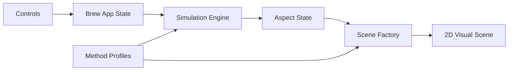

# Architecture

## Big Goal

Build a web-based coffee brewing visualizer that helps people understand brewing systems through interactive, layered simulations. The app should make invisible brewing forces visible: water flow, pressure, resistance, filter clogging, early extraction, late extraction, immersion behavior, and method-specific mechanics.

The first implementation is Pourover-only, but the architecture must grow naturally into:

- Pourover
- Aeropress
- French Press
- Moka Pot

The user should eventually be able to choose a brewing method, choose the brewing aspect they want to study, adjust parameters, and see the system respond in an interactive 2D visualization.

## Architecture Principles

- Keep the first version educational and heuristic, not research-grade physics.
- Separate brew method definitions from simulation logic and visual rendering.
- Let future methods reuse the same app shell, controls, playback model, and aspect selector.
- Keep formulas and assumptions explicit so simplified behavior is understandable.
- Prefer small TypeScript modules over framework-heavy structure until the product shape justifies more.

## Runtime Shape



## Core Concepts

### Brew Method

A brew method defines the equipment shape, available controls, default parameters, supported visual aspects, and simulation adapter.

Initial method IDs:

- `pourover`
- `aeropress`
- `french-press`
- `moka-pot`

Only `pourover` is interactive in the MVP. The other method IDs can exist as disabled or "coming later" options so the extension path is visible in code and UI.

### Visual Aspect

A visual aspect is a focused explanatory layer over the same brew state.

Initial aspect IDs:

- `flow`
- `pressure`
- `clogging`
- `extraction`
- `combined`

Each aspect should have:

- a label and educational description;
- a renderer emphasis strategy;
- the simulation fields it depends on;
- safe fallback behavior if a future brew method does not support it yet.

### Simulation State

The simulation state should be deterministic and serializable where practical. It should be driven by user parameters and elapsed simulation time, not by hidden render-only state.

For the Pourover MVP, state should include:

- time in seconds;
- water inventory and water height;
- flow intensity;
- pressure/head intensity;
- bed saturation;
- paper/bed clogging factor;
- early extraction intensity;
- late extraction intensity;
- drip output intensity.

### Scene Adapter

Each brew method should eventually own a 2D scene adapter. The app shell should not need to know whether it is rendering a cone, cylinder, press chamber, immersion carafe, or moka pot.

Expected adapter responsibilities:

- create method-specific geometry;
- update meshes from simulation state;
- emphasize the currently selected visual aspect;
- resize and dispose resources cleanly;
- expose a consistent `update(state, aspect)` style API.

## Initial Module Layout

```text
src/
  constants/
    simulation.ts
  model/
    aspects.ts
    brewMethod.ts
    simulationState.ts
  simulation/
    pouroverHeuristic.ts
  ui/
    controls.ts
  visual/
    pouroverScene.ts
  main.ts
```

### `src/model/brewMethod.ts`

Defines stable method IDs and method metadata. The MVP enables `pourover` and keeps the other methods represented as future extension points.

### `src/model/aspects.ts`

Defines visual aspect IDs, labels, descriptions, and support metadata.

### `src/model/simulationState.ts`

Defines shared simulation state shapes that the UI and visualization can consume without importing method-specific internals.

### `src/simulation/pouroverHeuristic.ts`

Contains the Pourover educational model. It converts user parameters and time into the visual state needed for water flow, pressure, clogging, and extraction timing.

### `src/visual/pouroverScene.ts`

Contains the 2D canvas scene for the Pourover MVP: brewer cone cutaway, paper filter, coffee bed, water surface, flow particles, drip stream, and visual overlays.

### `src/ui/controls.ts`

Owns DOM controls for method selection, aspect selection, parameter sliders, playback, scrubbing, and reset.

### `src/main.ts`

Wires the app shell, control events, simulation stepping, and scene updates.

## Extension Path By Method

### Aeropress

Future support should focus on immersion plus plunger pressure:

- chamber geometry;
- steeping time;
- plunger force;
- filter resistance;
- bypass/leakage if useful for teaching.

### French Press

Future support should focus on immersion and sediment separation:

- carafe geometry;
- grounds suspension;
- extraction over time;
- plunge speed;
- mesh filtering and fines carryover.

### Moka Pot

Future support should focus on pressure-driven percolation:

- lower chamber water;
- steam pressure;
- coffee basket resistance;
- upper chamber output;
- overheating or late-stage sputtering as educational signals.

## Validation Expectations

- The app must run in a browser with 2D canvas rendering.
- Controls must visibly affect the Pourover state.
- The aspect selector must change the visualization emphasis without changing the underlying method.
- Future brew methods should be addable by introducing new method profiles, simulation adapters, and scene adapters rather than rewriting the app shell.
